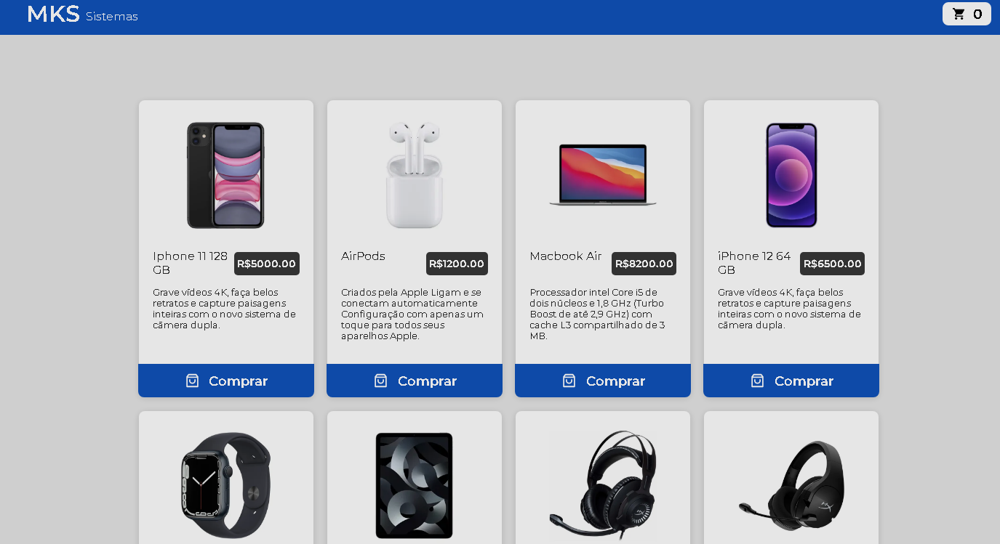
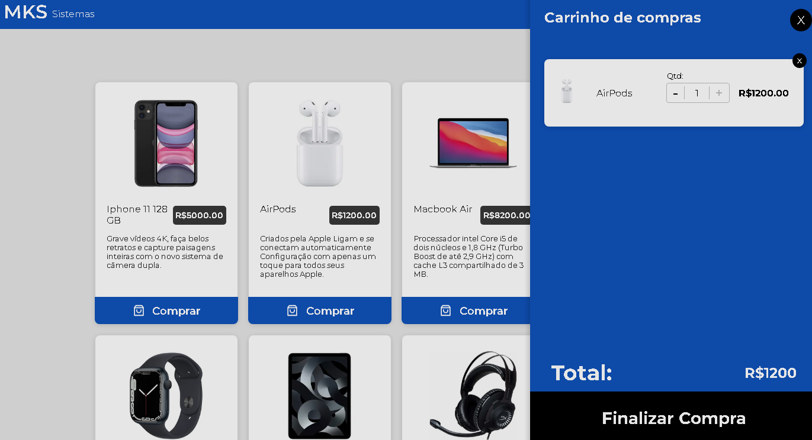

# MKS Systems

# Sobre o projeto
<a href="https://teste-tecnico-16mhh7qbb-cesarrafaeljunior.vercel.app/mainPage">Visualizar projeto</a>

O projeto se trata de uma simulação de um e-commerce de eletrônicos, várias funcionalidades comums de um e-commerce foram adicionadas, tais como, adicionar produtos no carrinho, alterar a quantidade do mesmo produto no carrinho, remover produtos do carrinho, alteração automatica no total de preços da compra.
O aplicativo consome uma Api Rest de produtos e os exibe na tela.

# Desafios
Este foi um dos primeiros projetos em que utilizei as tecnologias redux-toolkit, e para mim foi uma alegria muito grande porder aprender a trabalhar com esta ferramenta de controle de estados magnifica!

# Layout do projeto
## Página principal

## Página principal com o carrinho

# Tecnologias utilizadas:

- TypeScript
- React
- Redux toolkit
- Styled-components
- Axios
- React router Dom
- Vite

# Implantação em produção
- vercel

# Autor
César Rafael da Silva Júnior
Linkedin => https://www.linkedin.com/in/cesarrafaeljunior/

